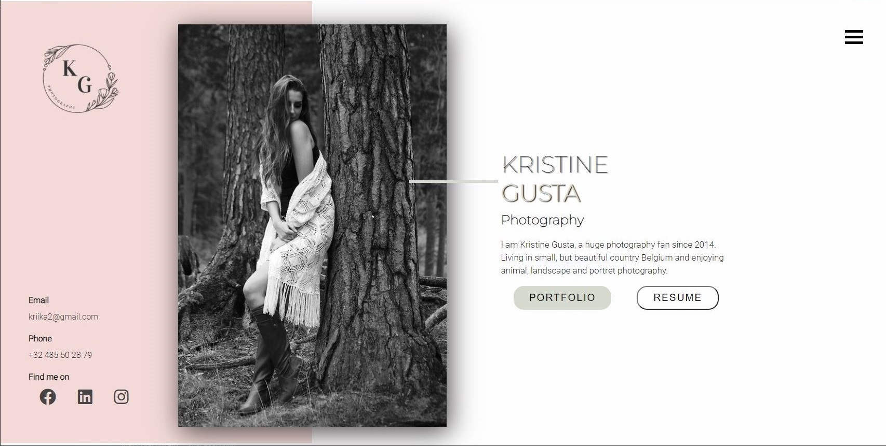

# vCard Portfolio mockup

***

Simple landing page design. Still practising HTML and CSS. Getting a little bit better with Responsive design.

On the main branch the Image is placed with Position : absolute.

On the second branch , tried to do the same but whitout Position : absolute. Sort of worked, but probably not the best way how to. :)

## GitHub page

Link on GitHub Pages [vCard](https://kristinegusta.github.io/v-card/).

## The result

